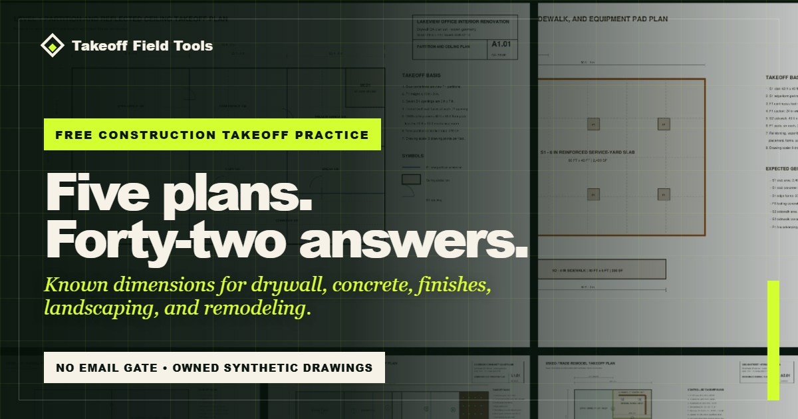

# Free construction takeoff practice plans

Five synthetic construction plan sets for practicing quantity takeoff without risking a real bid. Each PDF puts the measurable plan on page 1 and the formulas, units, and answer schedule on page 2.

Use paper scale, a PDF markup tool, a spreadsheet, or the takeoff software you already have. The goal is to measure first, compare second, and make every difference explainable.

## Download the complete pack

- [Download all five practice plans as one ZIP](https://github.com/krflol/takeoff-field-tools-practice-plans/releases/download/v1.1.0/takeoff-practice-plans-v1.zip)
- [Download the eight-page instructor guide](https://github.com/krflol/takeoff-field-tools-practice-plans/releases/download/v1.1.0/takeoff-practice-instructor-pack-v1.pdf)

These are the stable `v1.1.0` files. The ZIP includes the CC BY 4.0 license, source manifest, written practice instructions, and all five plan sets. Prefer one exercise at a time? Use the individual PDFs below.

## Download the exercises

| Trade | Exercise | Checks | PDF |
| --- | --- | ---: | --- |
| Drywall and metal framing | Lakeview office renovation | 9 | [Download](plans/drywall-office-renovation-plans.pdf) |
| Concrete and flatwork | Riverside service yard | 7 | [Download](plans/concrete-service-yard-plans.pdf) |
| Painting and flooring | Harborview clinic refresh | 7 | [Download](plans/clinic-interior-finishes-plans.pdf) |
| Landscaping and irrigation | Oakridge community courtyard | 9 | [Download](plans/landscape-courtyard-plans.pdf) |
| Mixed-trade remodeling | Cedar Street interior remodel | 10 | [Download](plans/cedar-street-remodel-plans.pdf) |

That is 42 quantity checks across counts, lengths, areas, and volumes.

For an instructor or team session, use the [eight-page facilitator guide](plans/takeoff-practice-instructor-pack-v1.pdf).

## Development and verification

The public [methodology and verification record](METHODOLOGY.md) explains how the synthetic geometry, scopes, drawings, and answer schedules were developed; documents the current review status and limitations; and links a machine-readable 42-check calculation set with a reproducible audit utility. The record distinguishes completed automated and manual checks from independent professional or classroom review, which has not occurred.

## Record the quantities in Excel

Use the [free construction quantity takeoff sheet and Excel template](https://takeofffieldtools.com/construction-quantity-takeoff-sheet.html?utm_source=github&utm_medium=repository&utm_campaign=helpful_tools&utm_content=quantity_takeoff_excel&ref=owned_practice_github) to record each measurement. The direct download includes a blank 100-row workbook, a worked example, visible formulas, unit and category dropdowns, source and assumption fields, and a review checklist. No account or email is required.

## Check the material behind a quantity

A measured area or length is only one input to an order. Use the [free construction material reference library](https://takeofffieldtools.com/material-costs/?utm_source=github&utm_medium=repository&utm_campaign=helpful_tools&utm_content=material_reference_library&ref=owned_practice_github) to compare purchase units, product specifications, and ordering checks for 13 common materials.

These source-backed guides explain what to verify before adding a supplier price to an estimate. They do not supply current local prices or establish product suitability for a project. Check the actual specification, current supplier quote, availability, taxes, delivery, and job conditions. No account or email is required.

## A simple practice routine

1. Open only page 1 and identify the labeled dimensions, scale, scope, units, and exclusions.
2. Calibrate from a labeled dimension. Do not trust a viewer or printer to preserve page size.
3. Record quantities with enough notes that another person can reproduce the method.
4. Open page 2 and compare the formula, unit, rounding, and result—not only the final number.
5. Investigate differences before changing the answer.

The interactive scorecard, individual previews, and complete bundle are available on the [free practice-plan page](https://takeofffieldtools.com/construction-takeoff-practice-plans.html?utm_source=github&utm_medium=repository&utm_campaign=helpful_tools&utm_content=practice_plan_library&ref=owned_practice_github).

## Important boundaries

- Every drawing is synthetic. No customer drawings or project data are included.
- These files are practice material, not construction documents.
- Do not use them for permitting, procurement, contracting, code compliance, structural design, or market-price benchmarking.
- A PDF viewer or printer can resize a sheet. Verify calibration from a labeled dimension before measuring.
- A correct practice result does not prove that a real bid is complete.

## Reuse and adapt

The five synthetic exercise PDFs, their answer schedules, and the written practice instructions are licensed under [Creative Commons Attribution 4.0 International](LICENSE.txt). You may copy, adapt, and redistribute them, including commercially, with appropriate attribution.

Suggested attribution:

> Takeoff Field Tools, Free Construction Takeoff Practice Plans with Answers, https://takeofffieldtools.com/construction-takeoff-practice-plans.html, CC BY 4.0.

See [LICENSE.txt](LICENSE.txt) for the complete license notice and [PERMISSION.md](PERMISSION.md) for a plain-language summary of what the license covers.

## Publisher and support

Published and maintained by Takeoff Field Tools. These exercises do not require an account, purchase, or commercial software. Questions and corrections are welcome at support@takeofffieldtools.com.
